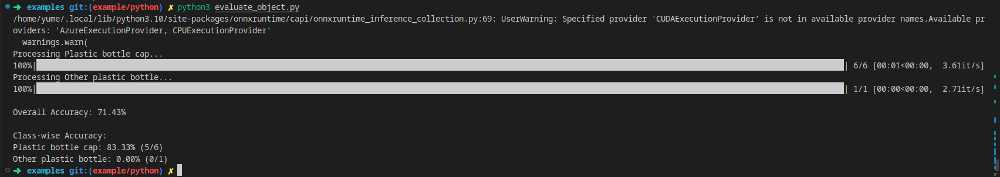

# Cosmic-noodle

POC of waste management system

## POC

### use examples folder to test the code

```bash
cd examples
```

To run the accuracy test, place the images in the `assets/test` folder and then label the image by folder name

```bash
python3 evaluate_object.py
```



To run the realtime detection

```bash
python3 detect_object.py
```


## requirements

- rust 1.78.7

## dependencies

- [onnxruntime](https://github.com/microsoft/onnxruntime/releases/tag/v1.17.3)

## references

- [model][https://github.com/jeremy-rico/litter-detection]
- [extract Mat pixel from this tutorial](https://docs.opencv.org/4.x/de/d06/tutorial_js_basic_ops.html)
- [StableView](https://github.com/Shubhamai/StableView)
- [Implementing YOLOv8 Object Detection with OpenCV in Rust Using ONNX Models](https://linzichun.com/posts/rust-opencv-onnx-yolov8-detect/)

## issues

- opencv binding won't build on my main machine (Kubuntu 22.4), the error [fatal error: 'memory' file not found](https://github.com/apple/swift-nio-ssl/issues/105)

- nokhwa can't build artifacts on my second machine (Kubuntu 24.4) error: v4l2-sys-mit invalid indent
